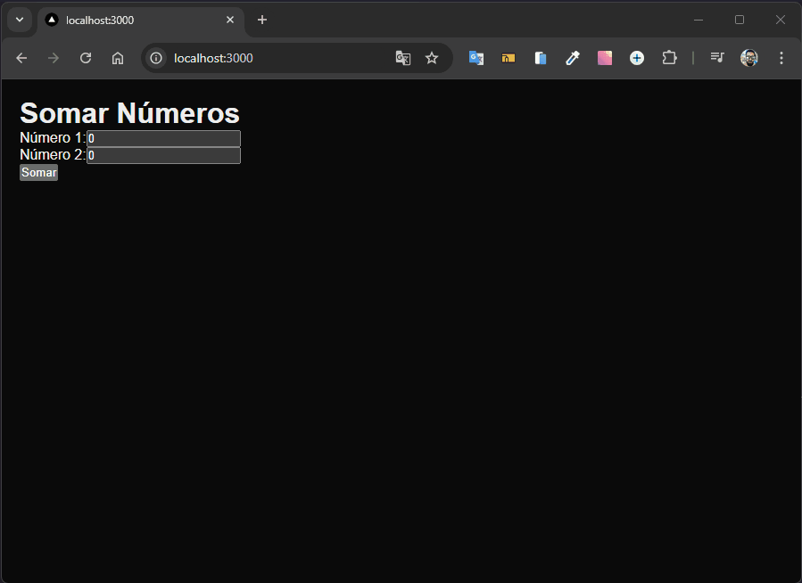

# Soma de Números com Next.js

Desenvolvido como exercício da disciplina de **Desenvolvimento com React** no curso de **Sistemas de Informação**.

Este projeto é uma implementação prática de uma página web simples, onde o usuário pode inserir dois números e obter a soma ao submeter o formulário. Foi desenvolvido para praticar conceitos de **Next.js** e **React**, incluindo a criação de componentes, gerenciamento de estado com hooks e manipulação de eventos.



## Tecnologias Utilizadas

- **Next.js**
- **React**
- **JavaScript**
- **HTML**
- **CSS**

## Estrutura de Pastas

```
📦 soma-de-numero-com-nextjs
 ┣ 📂 .next
 ┃ ┗ 📜 ...
 ┣ 📂 node_modules
 ┃ ┗ 📜 ...
 ┣ 📂 pages
 ┃ ┗ 📜 ...
 ┣ 📂 public
 ┃ ┗ 🖼️ favicon.ico
 ┣ 📂 styles
 ┃ ┣ 📜 globals.css
 ┃ ┣ 📜 Home.module.css
 ┣ 📜 .gitignore
 ┣ 📜 jsconfig.json
 ┣ 📜 next.config.mjs
 ┣ 📜 package-lock.json
 ┣ 📜 package.json
 ┣ 🖼️ somar-com-next.gif
 ┗ 📜 README.md
```

## Como Usar

1. Clone o repositório:

   ```bash
   git clone https://github.com/Alberesbass/soma-de-numero-com-nextjs.git
   ```

2. Acesse o diretório do projeto:

   ```bash
   cd soma-numeros
   ```

3. Instale as dependências:

   ```bash
   npm install
   ```

4. Inicie o servidor de desenvolvimento:

   ```bash
   npm run dev
   ```

5. Abra o navegador e acesse `http://localhost:3000` para visualizar a aplicação.

## Licença

Este projeto está sob a licença MIT. Consulte o arquivo [LICENSE](./LICENSE) para mais informações.

---

Desenvolvido por [Alberes](https://github.com/Alberesbass)

---